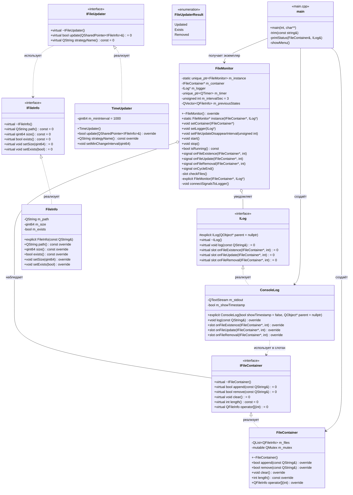
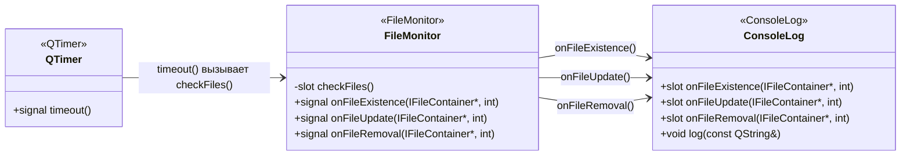

# FileMonitor — Консольное приложение для наблюдения за файлами

> Приложение для мониторинга состояния выбранных файлов: отслеживание существования и изменения размера.

---

## 📋 Оглавление
1. [Постановка задачи](#-постановка-задачи)
2. [Зависимости](#-зависимости)
3. [Архитектура решения](#-архитектура-решения)
4. [UML-диаграмма классов](#-uml-диаграмма-классов)
5. [Диаграмма сигналов и слотов](#-диаграмма-сигналов-и-слотов)
6. [Инструкция для пользователя](#-инструкция-для-пользователя)
7. [Сборка и запуск](#-сборка-и-запуск)
8. [Тестирование](#-тестирование)

---

## Постановка задачи
Необходимо разработать консольное приложение для наблюдения за выбранными файлами.

В рамках лабораторной работы отслеживаются две характеристики файла:
- факт существования;
- размер.

Программа должна выводить уведомления при изменении состояния файла.

Поддерживаются следующие сценарии:
1. Файл существует и не пустой: выводится сообщение о существовании файла и его текущий размер.
2. Файл существует и был изменен: выводится сообщение об изменении и новый размер файла.
3. Файл отсутствует: выводится сообщение об отсутствии файла.

Обработка изменений выполняется через механизм сигналов и слотов Qt.

---
## Зависимости
Для сборки и запуска нужны:
- Qt v5.12
- QMake v3.16
- Стандарт С++ 17

---
## Архитектура решения
- main.cpp — точка входа приложения. Несет ответственность за работу с терминалом и парсинг флагов.
- FileMonitor - модуль, отвечающий за наблюдением за переданными файлами
- log - модуль, отвечающий за логирование событий в системе
- ConsoleLog - singleton-логгер для вывода сообщений в консоль

---
## UML-диаграмма классов


---
## Диаграмма сигналов и слотов

---
## Инструкция для пользователя

## Сборка и запуск
### 1. Генерация Makefile из .pro файла
```bash
qmake FileMonitor.pro
```
### 2. Сборка проекта
```bash
make -j$(nproc)      # Linux / macOS
```
# или
```bash
mingw32-make -j4     # Windows (MinGW)
```

### 3. Запуск
```bash
./filemonitor        # Linux / macOS
```
# или
```bash
Debug\filemonitor.exe  # Windows
```
## Тестирование
### Case №1
Проверка запуска и отображения меню
- Входные параметры: -
    - Шаг 1: Скомпилировать и запустить приложение ./filemonitor
    - Шаг 2: Дождаться появления приглашения в терминале
- Результат: 
    - Приложение запускается без ошибок
    - Выводится меню: MENU: 1:add 2:remove 3:status 0:exit
### Case №2
Проверка добавления файла и команды 3
- Входные параметры:
    - Шаг 1: Скомпилировать и запустить приложение ./filemonitor
    - Шаг 2: Ввести 1, затем полный путь к файлу ../test/file1.txt
    - Шаг 3: Ввести 3 для проверки статуса 
- Результат: файл ../test/file1.txt присутствует в списке наблюдаемых файлов
### Case №3
Проверка изменения файла с изменением размера
- Входные параметры: файл ../test/file1.txt уже добавлен командой 1
    - Шаг 1: Дописать символ "3" в файл./test/file1.txt
- Результат: Приложение автоматически выводит уведомление об обновлении состоянии файла
### Case №4
Проверка изменения файла без изменения размера
- Входные параметры: файл ../test/file1.txt уже добавлен командой 1
    - Шаг 1: Заменить символ "3" на символ "4" 
    - Результат: Приложение автоматически выводит уведомление об обновлении состоянии файла    
### Case №5
Проверка удаления и повторного создания файла
- Входные параметры: файл ../test/file1.txt уже добавлен командой 1
    - Шаг 1: Ввод команды 2 и ввод пути ../test/file1.txt
    - Шаг 2: Ввод команды 1 и ввод пути ../test/file1.txt
- Результат: Вывод сообщений об отсутствии файла ../test/file1.txt и сообщение об существовании файла ../test/file1.txt
### Case №6
Проверка удаления из наблюдения
- Входные параметры: файл ../test/file1.txt уже добавлен командой 1
    - Шаг 1: Ввод команды 2 и ввод пути ../test/file1.txt
    - Шаг 2: Ввод команды 3
    - Шаг 3: Изменение файла ../test/file1.txt
- Результат: файл отсутствует в списке наблюдения, новые события по нему в приложении не появляются

### Unit-тесты 
Сборка и запуск unit-тестов:
```bash
qmake tests.pro
make -j$(nproc)
make check
```
